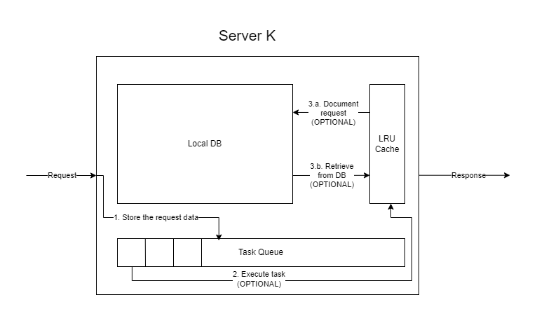
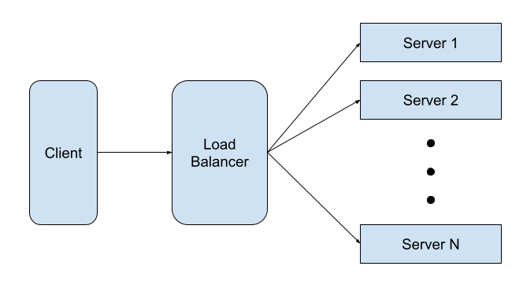

# **SDA-homework-2: Distributed Database**

**Ungureanu Vlad-Marin 315CA**

## Task Description

The program is a virtual database composed of multiple servers. Each server has a cache memory and a database of its own. The program supports storing documents, editing them and retrieving them. Also, the topology of the servers can be changed, as they can be removed or added at any time. All of the commands are given in the form of requests that either one of the servers of the system of servers handles.

### Functionalities
The program provides the following functionalities:
* **ADD_SERVER**: Adds a server to the system
* **REMOVE_SERVER**: Removes a server from the system
* **EDIT**: Edits or saves a document on a server.
* **GET**: Retrieves a document from a server and prints its contents.

### Commands
The described functionalities work by receiving the following inputs:
* **ADD_SERVER** <*server_id*> <*cache_size*>
* **REMOVE_SERVER** <*server_id*>
* **EDIT** <*document_name*> <*new_document_content*>
* **GET** <*document_name*>

### Bonus Feature
The program also includes the possibility of adding virtual servers, practically multiple instances of already existing servers. (not implemented yet)

## Usage
To use the program, follow these steps:
* Compile the program with the *`make build`* rule within the provided Makefile from the `skel/` directory
```bash
vlad@laptop:~SDA/hws/hw2$ cd skel/
vlad@laptop:~SDA/hws/hw2skel/$ make build
gcc -Wall -Wextra -g main.c -c
gcc -Wall -Wextra -g load_balancer.c load_balancer.h -c
gcc -Wall -Wextra -g server.c server.h -c
gcc -Wall -Wextra -g lru_cache.c lru_cache.h -c
gcc -Wall -Wextra -g utils.c utils.h -c
gcc main.o load_balancer.o server.o lru_cache.o utils.o add/hashtable.c add/linked_list.c add/queue.c add/specific_linked_list.c add/specific_queue.c -g -o tema2
```
* Run the program
```bash
vlad@laptop:~SDA/hws/hw2/skel$ ./tema2
```

## Data Structures
As requested by the [task description](https://ocw.cs.pub.ro/courses/sd-ca/teme/tema2-2024), the program is build around three main data structures:
* **LRU Cache**: a memory structure that allows for faster accessing of recently used files, by storing them in reverse order of accessing
* **Server**: a data structure containing a LRU Cache, a task queue and a database; it is able to handle the document related requests

* **Load Balancer**: a data structure containing a list of servers; it can handle server related requests and forwards the other ones to the servers


## Implementation Information
The code is spread throughout ten C source files to make reading them individually easier. The functions are divided as follows:
* `skel/main.c`: contains all of the functions that handle the input and forward the tasks to the other functions. I have not modified this file.
* `skel/utils.c`: contains the hash functions used by the load balancer. I have not modified this file.
* `skel/lru_cache.c`: contains the implementation for the LRU Cache and all of its functions
* `skel/server.c`: contains the implementation for the Server and all of its functions
* `skel/load_balancer.c`: contains the implementation for the Load Balancer and all of its functions
* `skel/add/linked_list.c`, `skel/add/queue.c`, `skel/add/hashtable.c`: contain implementations of the data structures borrowed from the 7th lab [skeleton](https://ocw.cs.pub.ro/courses/_media/sd-ca/laboratoare/lab07_2024.zip)
* `skel/add/specific_linked_list.c`, `skel/add/specific_queue.c`: contain more specific implementations for some of the functions in the previous files

These source files are aided by ten header files:
* `skel/lru_cache.c`, `skel/server.c`, `skel/load_balancer.c`, `skel/add/linked_list.c`, `skel/add/queue.c`, `skel/add/hashtable.c`, `skel/add/specific_linked_list.c`, `skel/add/specific_queue.c`:contain the headers of the corresponding C files and the declarations of the 
* `skel/utils.c`: contains the previous thing, plus the declaration for the `DIE` and `PRINT_RESPONSE` macros
* `constants.h`: contains the constants used by the program and the declaration of the request type

## Implementation
### ADD_SERVER
The `loader_add_server()` function is called. It finds the slot where the new server should be added and the next server. It then checks the database of the next server and moves some of the files from it to the next server. It then adds the server on its corresponding place in the list of servers.

### REMOVE_SERVER
The `loader_remove_server()` function is called it finds the server that needs to be removed and the next one and moves all of the files from the first to the second one. It then removes the server from the list and frees its memory.

### EDIT
The load balancer finds the server that corresponds to the file and forwards the request to it. The `server_edit_document()` function is called. It looks for the file in the server's database. If it exists, it updates its contents, then adds the file to the cache and prints a appropriate response from the serve.

### GET
file and forwards the request to it. The `server_get_document()` function is called. It looks for the file in the server's database and returns its contents within a corresponding response from the server. It also adds the file to the cache.

## Personal Comments
### Do I believe I could have made a better implementation?
Yes. I think it could have been implemented in an easier way. I came across a lot of really annoying errors that took a lot of time to fix. As proof, at the time of writing this, i gave up on fixing one of the errors.

### What did I learn from this homework?
I learned how a network of server could work and also that errors could hide where no one would think to look.

### Note
I had to add specific functions for the queue and the linked list because I need them to contain structures that contained strings and needed special treatment (i. e. the structures had to be copied/freed one field at the time), most of these functions are almost identical to their general counterparts, co I've only added comments to the different parts.

## Resources / Bibliography:
* The [skeleton](https://ocw.cs.pub.ro/courses/_media/sd-ca/laboratoare/lab07_2024.zip) for the task 'courses.c' form the 7th lab: the implementations for the linked list, queue and hashtable (because they are borrowed, I did not add comments).
* The [skeleton](https://github.com/sd-pub/Tema2-2024) for this task.